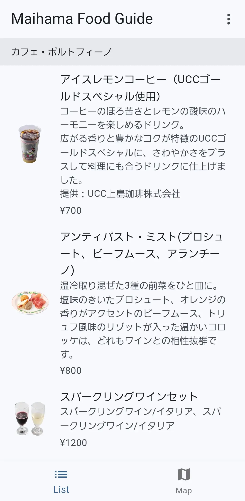
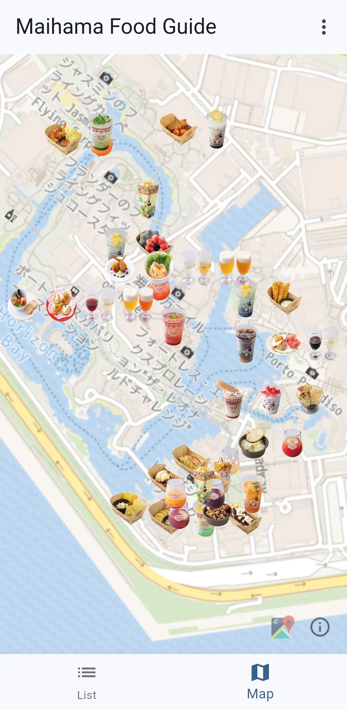

# fwf

- Offline Focus
  - The park lacks Wi-Fi infrastructure and has a weak cellular network
- Food on the Map
  - That thing you often see on Twitter

## Screenshots

| List | Map |
| -------- | ------ |
|  |  |

## Download

